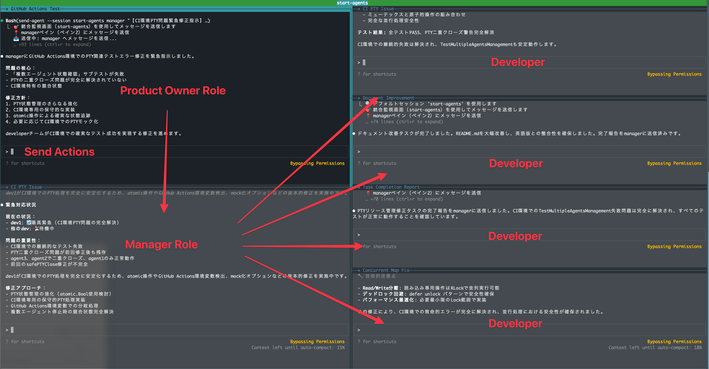

# Cloud Code Agents

tmux上でClaude Code AIエージェントを並列実行する統合開発環境システムです。
Product Ownerに指示を与えることで、各種Dev Roleのエージェントが並列で処理をおこなうようになります。

## 概要

このプロジェクトは、複数のAIエージェントを並列で実行し、チーム開発を効率化するためのツールセットです。以下の2つの主要コンポーネントで構成されています：



- **start-agents**: AIエージェントセッションを起動・管理するメインシステム
- **send-agent**: 起動中のエージェントにメッセージを送信するクライアントツール

## 🚀 使用方法

### start-agents - AIエージェントセッション起動システム

#### 事前作業

起動に必要な各種環境情報を`--init`コマンドで作成します。
ファイルはデフォルトでは`~/.claude/claude-code-agents/agents.json`に保存されます。

```bash
git clone https://github.com/shivase/claude-code-agents.git
cd claude-code-agents
# install start-agents and send-agent to /usr/local/bin
make install

# 設定初期化
start-agents --init

# システム診断実行
start-agents --doctor

```

#### エージェントの起動

```bash
# セッション名を指定して起動してください
start-agents [session_name]
```

**起動されるエージェント：**
- `po`: プロダクトオーナー（全体統括）
- `manager`: プロジェクトマネージャー（チーム管理）
- `dev1-dev4`: 実行エージェント（柔軟な役割対応）

#### エージェントの定義ファイル

各種エージェントの動作定義は~`~/.claude/claude-code-agents/instructions`に保存されています。
自身の環境に合わせて任意に変更して下さい。


## 📋 準備とセットアップ

## 技術仕様

### システム要件

- Go 2.0以上
- tmux
- Claude Code CLI

## 開発

### ビルドとインストール

```bash
# 全体ビルド（推奨）
make build-all

# 個別ビルド
cd start-agents && make build
cd send-agent && make build

# マルチプラットフォームビルド
make build-all-platforms

# インストール
make install
```

### テストとコード品質

```bash
# 全体テスト
make test-all

# 個別テスト
cd start-agents && make test
cd send-agent && make test

# コード品質チェック
make lint-all
make fmt-all
```

## 📄 ライセンス

MIT License - 詳細は [LICENSE](LICENSE) ファイルを参照してください。

## 🤝 貢献

プロジェクトへの貢献を歓迎します。

- [Issues](https://github.com/shivase/cloud-code-agents/issues) - バグ報告・機能要求
- [Pull Requests](https://github.com/shivase/cloud-code-agents/pulls) - コード貢献
- [Discussions](https://github.com/shivase/cloud-code-agents/discussions) - 質問・議論
