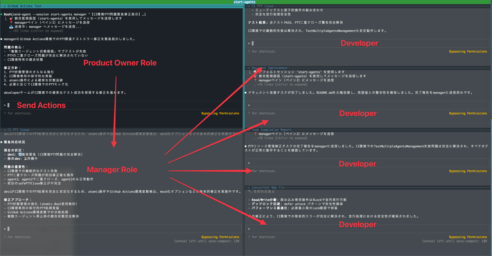

# Cloud Code Agents - Integrated Multi-Agent System

[](https://golang.org/)
[](../LICENSE)
[](https://github.com/shivase/cloud-code-agents/actions)
[](https://github.com/shivase/cloud-code-agents/actions)

An integrated development environment system that runs multiple Claude Code AI agents in parallel on tmux.
By providing instructions to the Product Owner, various Dev Role agents process tasks in parallel.

📖 [日本語README](../README.md)

## Overview

This project is a comprehensive toolkit for running multiple AI agents in parallel to streamline team development. It consists of two main components:



- **start-agents**: Main system for launching and managing AI agent sessions
- **send-agent**: Client tool for sending messages to running agents

## 🚀 Usage

### start-agents - AI Agent Session Management System

#### Preliminary Setup

Create the necessary environment information for startup using the `--init` command.
Files are saved by default to `~/.claude/claude-code-agents/agents.json`.

```bash
git clone https://github.com/shivase/claude-code-agents.git
cd claude-code-agents
# install start-agents and send-agent to /usr/local/bin
make install

# Initialize configuration
start-agents --init

# Run system diagnostics
start-agents --doctor
```

#### Starting Agents

```bash
# Please specify a session name for startup
start-agents [session_name]
```

**Launched Agents:**
- `po`: Product Owner (Overall coordination)
- `manager`: Project Manager (Team management)
- `dev1-dev4`: Execution agents (Flexible role assignment)

#### Agent Definition Files

The operational definitions for various agents are stored in `~/.claude/claude-code-agents/instructions`.
Please modify them according to your environment as needed.

## 📋 Preparation and Setup

## Technical Specifications

### System Requirements

- Go 2.0 or later
- tmux
- Claude Code CLI

## 🛠️ Development

### Build and Installation

```bash
# Full build (recommended)
make build-all

# Individual builds
cd start-agents && make build
cd send-agent && make build

# Multi-platform builds
make build-all-platforms

# Install
make install
```

### Testing and Code Quality

```bash
# Full test suite
make test-all

# Individual tests
cd start-agents && make test
cd send-agent && make test

# Code quality checks
make lint-all
make fmt-all
```

### CI/CD Support

```bash
# Local CI execution
make ci-local

# Release build
make release
```

## 📄 License

MIT License - See [LICENSE](../LICENSE) for details.

## 🤝 Contributing

We welcome contributions to the project.

- [Issues](https://github.com/shivase/cloud-code-agents/issues) - Bug reports & feature requests
- [Pull Requests](https://github.com/shivase/cloud-code-agents/pulls) - Code contributions
- [Discussions](https://github.com/shivase/cloud-code-agents/discussions) - Q&A & discussions
